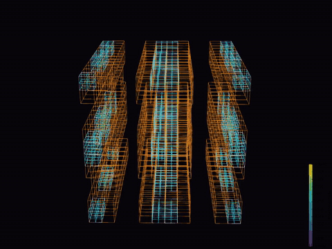

# JP Solver

JP Solver is a GPU-native CFD solver where the entire hot path runs on the GPU. It solves the
lattice Boltzmann method with three-level adaptive mesh refinement, validated on the 3D
Taylor-Green vortex, and is designed to extend to further physics and couplings.



Full render on YouTube: https://www.youtube.com/watch?v=mv-WQxnAyp4

## The name

JP Solver stands for José Pedro's Solver. The project exists to put a single design philosophy and
years of computational science experience into a running solver, rather than leaving them in notes
and papers. The principle at its center is GPU-native execution, and the name marks the codebase as
the place where that rule is carried through without compromise, from the lattice Boltzmann core
today to whatever physics attaches on top of it later.

## Philosophy: GPU-native

The design rule is single. The solver never leaves the GPU during a time step. Everything that
runs inside the loop is a device kernel, and only scalar counts and finished output frames ever
cross back to the host:

* **Step.** D3Q19 BGK, FP32, a fused pull that streams then collides.
* **Adaptation.** The sensor, the marking, the exact threshold (a sort in VRAM), the prefix sum,
  the scatter of the block tables, the 2:1 balance and the skin lists all run on the device. Only
  scalar counts return. The initial build and every regrid take the same path.
* **Diagnostics.** Energy, enstrophy and mass come from a device composite kernel and an atomic
  reduction that returns three doubles, instead of copying the whole state to the host.
* **Field output.** The Q-criterion and speed are computed on the device; only the assembled field
  is copied once, for the VTK writer.

Host round-trips are the tax this project refuses to pay. The payoff is a loop whose cost is set by
the GPU memory system, not by driver traffic or synchronisation.

## What it solves today

* Lattice Boltzmann, D3Q19, BGK collision, FP32.
* Three-level structured AMR: a dense coarse grid (level 0), a scattered set of level-0 blocks
  refined 2x (level 1), and a scattered set of level-1 blocks refined 2x again (level 2). Nested
  subcycle 1:2:4 (coarse once, level 1 twice, level 2 four times), with restriction from fine to
  coarse and prolongation for the coarse-to-fine ghost layer. 2:1 balance is enforced across levels.
* Case: the 3D Taylor-Green vortex, periodic, the canonical transition-to-turbulence benchmark.

## Build

Requires the CUDA toolkit (`nvcc`). Tested with CUDA 12.0 on an RTX 2060 (sm_75).

```sh
make                 # builds ./amr and ./uniform
make ARCH=sm_80      # target a different GPU architecture
```

## Run

```sh
# Uniform reference (single level), the validation baseline:
./uniform --n 128 --re 1600 --tstar 12

# Adaptive solver, gold test (refine every level, must reproduce the uniform 4N run):
./amr --n 32 --re 800 --l1 all --l2 all

# Adaptive solver, dynamic sensor-driven refinement, writing frames for a movie:
./amr --n 48 --re 1600 --l1 sensor --l2 sensor --vtk out --frames 240
```

Key flags:

| Flag | Meaning |
|---|---|
| `--n` | Base resolution. For `amr` this is the coarse grid; the finest level is 4x this. |
| `--re` | Reynolds number. |
| `--tstar` | Non-dimensional end time (eddy turnover units). |
| `--l1`, `--l2` | Refinement mode per level: `all`, `slab` or `sensor` (vorticity-driven). |
| `--frac1`, `--frac2` | Target refined fraction per level for the sensor mode. |
| `--vtk <prefix>` | Write `.vti` fields and `.vtp` level boxes per frame. |
| `--frames` | Number of output frames. |
| `--bench` | Report solver throughput without diagnostics or output. |

## Performance and memory vs uniform

Measured on an RTX 2060 6 GB, sm_75, CUDA 12.0, default clocks, FP32,
`nvcc -O3 -arch=sm_75 -DMB=8 -maxrregcount=128`. Work is counted as actual lattice updates per
coarse step, `(cnb0 + 2*nf1 + 4*nf2) * MB^3`, so the fine levels carry their subcycle multiplier
and throughput is normalised by real work.

The uniform 192^3 reference reaches 1342.8 MLUPS, which is 95 percent of the D3Q19 DRAM ceiling on
this card. The optimised AMR runs at about 450 MLUPS, roughly 33 percent of that ceiling. The gap
is the coarse-fine interface (prep plus ghost fill), about 65 percent of the step time and largely
intrinsic to scattered refinement, not a tuning defect.

The point of the AMR is not raw throughput but total cost for the same physics. On the dynamic case
(coarse 48, fine 192, sensor on both levels) at matched physical time:

| metric | AMR 3-level | uniform 192^3 | ratio |
|---|---|---|---|
| wall-clock | 3.3 s | 12.7 s | **3.8x faster** |
| pool memory | 0.47 GB | 1.08 GB | **2.3x less** |
| work (lattice updates) | 1.46e9 | 1.70e10 | **11.7x less** |

The AMR does 11.7x less work; even at a third of the uniform efficiency it still finishes 3.8x
faster and in 2.3x less memory. A refinement buffer raises the per-kernel MLUPS but explodes the
refined volume on this space-filling flow, so the default buffer is zero: it pays only for
localized features.

## Validation

Tolerances are fixed before each run. The 3D Taylor-Green vortex is validated against direct
numerical simulation (Brachet et al., 1983; van Rees et al., 2011).

| Case | Reference | Criterion | Result |
|---|---|---|---|
| Uniform TGV, N=192, Re=1600 | DNS | enstrophy peak time, monotonic energy | peak at t\*=8.93 (DNS 9.0), energy monotonic, mass drift < 1e-4 |
| Static gold (refine all levels) | uniform 4N | peak time within 0.3 in t\*, energy within 2 percent | peak time delta 0.108, energy within 1.98 percent |
| Dynamic gold (sensor) | uniform | breakdown present, energy monotonic, mass held | passes |

An honest limit: partial refinement over-dissipates the small scales, so the adaptive run peaks
earlier and lower than the fully resolved DNS. The AMR movie is a demonstration of the method, not
a DNS-grade result; only the uniform solver matches the literature spectrum.

## Visualization

The solver writes XML VTK ImageData (`.vti`) fields with the Q-criterion, speed and velocity, plus
level boxes (`.vtp`). `scripts/render_tgv3d.py` renders a Q-isosurface movie with level-colored
boxes in ParaView (`pvbatch`), and `scripts/preview_tgv3d.py` produces a quick GL-free preview with
numpy and matplotlib.

```sh
./amr --n 48 --re 1600 --l1 sensor --l2 sensor --vtk out --frames 240
pvbatch scripts/render_tgv3d.py --in out --out frames
```

## License

MIT. See [LICENSE](LICENSE).
